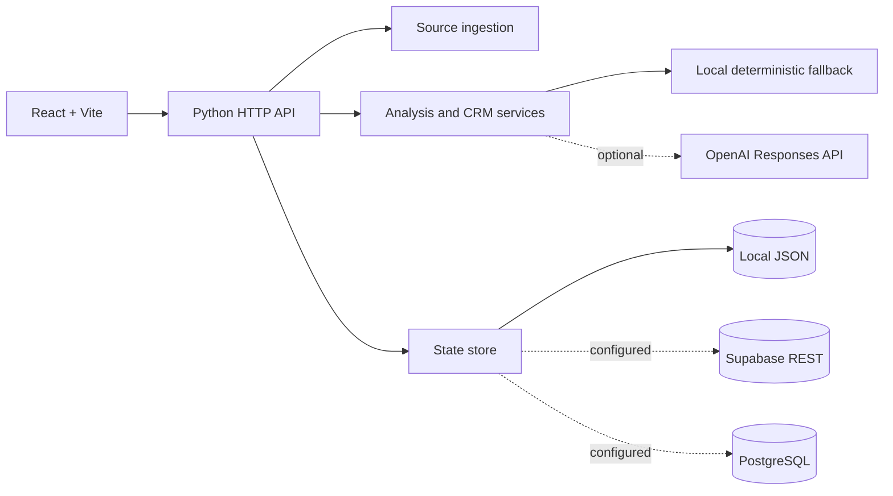

# EditalSales

Radar de editais e CRM operacional para transformar chamadas públicas em oportunidades acompanháveis para artistas e projetos culturais.

**Status: experimental — aplicação local funcional; o deploy anteriormente associado ao repositório está indisponível.**

## Por que existe

Editais públicos chegam por fontes heterogêneas, com prazos, requisitos e documentos difíceis de acompanhar. O EditalSales reúne descoberta, análise, relacionamento entre edital/artista/projeto, checklist documental e histórico de decisão em uma única superfície.

## O que funciona hoje

- cadastro, importação e consulta de editais;
- CRM de oportunidades, artistas, projetos e documentos;
- fontes configuráveis com sincronização manual;
- polling de fontes explicitamente opt-in;
- análise e chat com fallback local determinístico;
- enriquecimento opcional pela OpenAI Responses API;
- persistência em JSON local, memória de contingência, Supabase HTTP ou PostgreSQL;
- trilha de auditoria no estado da aplicação.

```text
source → ingestion → normalized edital → analysis
                              ↓
artist / project → opportunity → documents → decision history
```

## Arquitetura



The Python backend is the current canonical API. The older `server/` Node implementation remains in the repository as a migration artifact and is not the documented runtime.

## AI boundary

Without `OPENAI_API_KEY`, the main product remains usable: imported editais receive local analysis, opportunity suggestions and chat responses from deterministic application logic.

With `OPENAI_API_KEY`, selected analysis and chat flows call the configured OpenAI Responses endpoint using structured JSON schemas. Source content and application context sent to that integration leave the local process; operators must review their data-handling requirements before enabling it.

## Persistence modes

| Configuration | Behavior |
| --- | --- |
| No database variables | Reads/writes `backend/data/state.json`; falls back to process memory if the filesystem is unavailable |
| `SUPABASE_URL` + `SUPABASE_SERVICE_ROLE_KEY` | Uses the Supabase REST API and configured state row |
| `DATABASE_URL` | Uses PostgreSQL through `psycopg`; Supabase pooler URLs are supported |

Remote persistence stores the current application state as one JSON document keyed by `SUPABASE_STATE_KEY`. This is suitable for the present experimental single-process model, not high-volume multi-writer operation.

## Local development

Requirements: Node.js 20+, npm and Python 3.11+.

```bash
git clone https://github.com/4LFR3Dv1/EditalSales.git
cd EditalSales
cp .env.example .env
npm ci
python -m pip install -r backend/requirements.txt
```

Run the backend and frontend in separate terminals:

```bash
npm run backend
```

```bash
npm run dev
```

The UI defaults to `http://localhost:5173`; the API listens on `http://localhost:8000` and exposes `/api/v1`.

## Configuration

Use [`.env.example`](.env.example) as the complete variable index.

- `SOURCE_POLLING_ENABLED=0` keeps scheduled ingestion off; manual sync remains available.
- `OPENAI_API_KEY` is optional.
- `SUPABASE_SERVICE_ROLE_KEY` is a backend secret and must never use a `VITE_` prefix or enter browser code.
- `CORS_ORIGIN=*` is a development convenience; set the exact deployed frontend origin outside local development.

For Supabase REST persistence, create the state table:

```sql
create table if not exists public.app_state (
  state_key text primary key,
  data jsonb not null,
  updated_at timestamptz not null default now()
);
```

## Verification

```bash
npm run verify
```

The gate runs the frontend production build, Python unit tests and bytecode compilation. It does not exercise external source sites, OpenAI, Supabase or PostgreSQL.

## Repository structure

```text
src/                 React product interface
backend/app/main.py  HTTP API and route dispatch
backend/app/ingest.py source acquisition and normalization
backend/app/services.py analysis, matching and chat workflows
backend/app/store.py state coordination and local fallback
backend/app/db.py    Supabase/PostgreSQL adapters
server/              legacy Node migration artifact
supabase/            database setup artifacts
```

## Security and privacy

- Treat imported documents and artist records as potentially sensitive.
- Keep OpenAI, Supabase and database credentials server-side.
- Restrict CORS to the deployed frontend.
- Source ingestion performs outbound requests and should use reviewed allowlists before broader deployment.
- No external security audit is claimed.

## Limitations

- The public deploy URL previously stored in GitHub currently returns 404.
- There is no authentication or multi-tenant authorization boundary in the documented local flow.
- State persistence is document-oriented and guarded only within one process.
- External source parsers can break when publisher markup changes.
- Integration tests for external providers and a browser E2E suite are not yet present.
- Screenshots and a current public demo remain evidence gaps.

## License

No license file has been published. Source availability does not by itself grant reuse or redistribution rights; licensing remains a maintainer decision.
